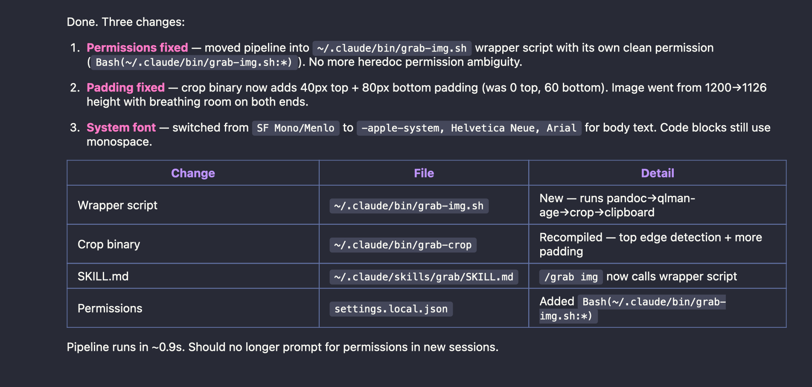

# /grab — Screenshot Claude Code Responses

A [Claude Code](https://docs.anthropic.com/en/docs/claude-code) skill that captures assistant responses as beautifully styled images, Slack-formatted text, or rich text — copied straight to your clipboard.



## Modes

| Mode | Command | Speed | Output |
|------|---------|-------|--------|
| Fast image | `/grab` | ~2s | Raw markdown rendered with [silicon](https://github.com/Aloxaf/silicon) (Dracula theme) |
| Polished image | `/grab img` | ~0.9s | Pandoc HTML with Dracula CSS, captured via `qlmanage` and auto-cropped |
| Slack | `/grab slack` | instant | Markdown converted to Slack `mrkdwn` format |
| Docs | `/grab docs` | ~1s | Rich text (RTF) via Pandoc |

## Requirements

- **macOS** (uses `qlmanage`, `osascript`, `sips`)
- [Pandoc](https://pandoc.org/) (`brew install pandoc`)
- [Silicon](https://github.com/Aloxaf/silicon) (`brew install silicon`) — only needed for `/grab` (fast image mode)
- Swift compiler (included with Xcode Command Line Tools)

## Install

```bash
git clone https://github.com/nckobrien-arch/claude-grab.git
cd claude-grab
./install.sh
```

Or manually:

```bash
# Copy skill
mkdir -p ~/.claude/skills/grab
cp SKILL.md ~/.claude/skills/grab/SKILL.md

# Copy and compile binaries
mkdir -p ~/.claude/bin
cp bin/grab-img.sh ~/.claude/bin/grab-img.sh
cp bin/grab-crop.swift ~/.claude/bin/grab-crop.swift
chmod +x ~/.claude/bin/grab-img.sh
swiftc -O -o ~/.claude/bin/grab-crop ~/.claude/bin/grab-crop.swift
```

## Usage

In any Claude Code conversation:

```
> explain this function

[Claude responds with explanation]

> /grab img
```

The response is rendered as a styled PNG and copied to your clipboard. Paste it anywhere.

### All commands

- **`/grab`** — fast screenshot using silicon (raw markdown, monospace)
- **`/grab img`** — polished screenshot with styled HTML (system font, colored headers, table borders)
- **`/grab slack`** — copies as Slack-formatted text
- **`/grab docs`** — copies as rich text (paste into Google Docs, Word, etc.)

## How `/grab img` works

1. **Pandoc** converts the markdown to standalone HTML with inline Dracula CSS (cyan headers, pink bold, green italic, purple table headers)
2. **qlmanage** renders the HTML to a 2000x2000 PNG thumbnail using macOS Quick Look
3. **grab-crop** (compiled Swift binary, ~0.05s) auto-detects content bounds by scanning for background color from the edges, then crops with padding
4. **osascript** copies the cropped PNG to the clipboard

## Permissions

If you want the skill to run without permission prompts, add these to `~/.claude/settings.local.json` under `permissions.allow`:

```json
"Bash(cat <<'GRAB_EOF' > /tmp/claude-grab:*)",
"Bash(~/.claude/bin/grab-img.sh:*)",
"Bash(silicon:*)",
"Bash(sips:*)",
"Bash(osascript -e 'set the clipboard:*)",
"Bash(pandoc -f markdown -t plain:*)"
```

## License

MIT
